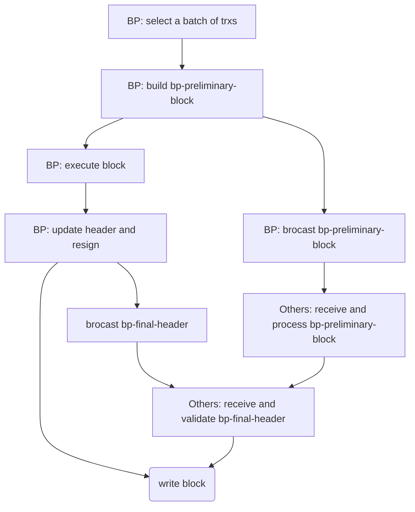

- [Chaos consensus](#chaos-consensus)
  - [1 System model](#1-system-model)
  - [2 Validator committee](#2-validator-committee)
  - [3 Validator random selection](#3-validator-random-selection)
    - [3.1 Properties of random number generation for blockchain](#31-properties-of-random-number-generation-for-blockchain)
    - [3.2 Cube's RNG algorithm](#32-cubes-rng-algorithm)
      - [3.2.1 Initialization](#321-initialization)
      - [3.2.2 RNG process](#322-rng-process)
    - [3.3 Property analysis of the RNG algorithm](#33-property-analysis-of-the-rng-algorithm)
      - [3.3.1 Unpredictable](#331-unpredictable)
      - [3.3.2 Unbiased](#332-unbiased)
    - [3.4 Data volume analysis of the RNG process](#34-data-volume-analysis-of-the-rng-process)
  - [4 Streamline Consensus](#4-streamline-consensus)
    - [4.1 Problem](#41-problem)
    - [4.2 A new process for proposing and verifying blocks](#42-a-new-process-for-proposing-and-verifying-blocks)
    - [4.3 Some detailed issues and solutions](#43-some-detailed-issues-and-solutions)
  - [5 Fast finality](#5-fast-finality)
    - [5.1 Deferred BFT attestation](#51-deferred-bft-attestation)
    - [5.2 Waiting blocks for deferred voting](#52-waiting-blocks-for-deferred-voting)
# Chaos consensus

Consensus is the core components of blockchain, and Cube uses a hybrid randomized DPOS protocol, which we named “Chaos Consensus”. This protocol is based on the DPOS consensus and introduces a random selection mechanism for nodes, which allows more nodes to participate in the consensus and increases the decentralization of the system. The BFT consensus mechanism is used among the consensus nodes to provide the system with fast confirmation of transactions. In addition, the traditional consensus process is disassembled into separate transaction sequence consensus and execution result consensus, and together with the execution process, a pipeline mechanism is formed for transaction processing, which greatly improves the overall throughput of the system.

## 1 System model

On the network model, Cube assumes a semi-synchronous network by which we mean that the network traversal time can be modeled by a random variable Y whose probability distribution is known. The network is mostly near-synchronous, and most messages can be propagated to most nodes in the network after a limited delay time $\delta$. The network can be completely asynchronous, but such a state does not last long and can eventually recover to a near-synchronous state.

For the economy model, we take the assumption of majority honest token staking just as most of the PoS public chains, that is the most staking is held by honest nodes, and a node with more stakings is more motivated to keep the network with safety and liveness. 

Based on the above security assumptions, combined with the blockchain network performance goals and decentralization goals, we will consider selecting the top $k$ validators from a large set of collateral nodes, i.e., the set of candidate validators, based on DPoS rules, and then randomly selecting $l$ validators from the remaining validators based on a random selection mechanism to jointly form a $n=k+l$ committee of validators, which will be responsible for the consensus in one phase (i.e., one epoch).

Before considering the values of $k$, $l$, we first consider the attack model.

In terms of branch selection and finality, Cube will use the longest chain mechanism similar to `Clique` and combine it with the BFT attestation mechanism to achieve fast finality. At the same time, the Cube chain, like all other public chains, is open source and the chain protocol is open source too, so malicious nodes cannot trick honest nodes into accepting blocks or transactions that do not conform to the rules. Therefore, the only malicious acts (attacks launched) that an adversary can perform will be limited to the followings:

* Control no less than $(n/2 + 1)$ validators, then it can make double spend, or just halt the whole block chain.
* Control more than $(n/3)$ validators, then it can break the fast finality of Cube, but because there's punishment for double votes, so it can not make an unrevoverble fork.

Because the majority of tokens are staked by honest validators, we believe that among the top $k$ validators by staking (which is a quite small value, i.e. equivalent to the top 20% of validators), there will be at least 75% of validators are honest. Meanwhile, there are basically no less than 2/3 of validators who are honest among the rest of the candidate validators that have a few less staking. Based on this situation, randomly selecting $l$ validators, then the probability that all of the $l$ validators are malicious is not negligible. We suppose that the adversary is strong enough to conspire with all malicious nodes to act together, we have the following security conditions:

Let $l'$ be the malicious validators among the randomly selected $l$ validators,

* Security condition: $(1/4)k + l' < n/2 + 1$
* Fast finality condition: $(1/4)k + l' < n/3$

As the analysis above, when $n=21$, we choose $k=15,l=6$, then we can completely guarantee the security. And then, suppose there are $m$ candidate validators, among which there are about $m/3$ potential malicious, and if the random selection is unbiased and unpredictable, then the probability of $l'$ malicious validators is:
$$P(X=l') = (C_{m/3}^{l'} C_{2m/3}^{l-l'}) / C_{m}^{l}$$ 

Based on the previous setting, when the number of candidate validators is around 100, it can be measured that there is more than a 93% probability that the fast finality condition will be met.

Actually, since breaking fast finality does not bring any visible benefit to the adversary, it further reduces the possibility of malicious behaviors. Therefore, fast finality is guaranteed in the vast majority of cases.

In summary, Cube combines DPoS and random selection to form a committee, this mechanism can guarantee security and fast finality while balancing performance.

## 2 Validator committee

Cube is based on the DPoS mechanism, where users can register to be a validator by providing stakings that meet the minimum threshold requirements. Other users (delegators) can delegate their stakings to their trusted validator, and the validator will participate in the consensus representing itself and all its delegators. All valid validators form a candidate validator set and then form a validator committee based on DPoS plus a random selection mechanism, which will be responsible for consensus operations such as block proposal, block verification, and fast finality attestation voting within a specific phase.

Specifically, Cube divides the chain by epoch, where an epoch consists of a specific number of consecutive blocks (e.g., 400 blocks per epoch). Within an epoch, a validator committee will be generated, which will then be responsible for consensus operations for a later epoch (the committee for the first epoch is determined by the Genesis block).

The committee size in Cube will be set to 21, in which the top 15 validators will be the committee members according to the DPoS rules, and then 6 validators will be randomly selected from the remaining set of validators to become committee members.

Based on the committee mechanism, Cube can achieve better performance, and based on the random selection mechanism, it can expand the consensus participation and increase the decentralization of Cube. Based on the aforementioned security model, we can confirm that the above setup can secure the blockchain while satisfying the fast finality requirement with a very high probability.

## 3 Validator random selection

Cube proposes an on-chain random number generation scheme based on multiparty participation using the Public Verifiable Secret Sharing (PVSS) technique. Based on the application goal of validator random selection, Cube only needs to generate one random number in one epoch.

### 3.1 Properties of random number generation for blockchain

Before discussing the on-chain random number generation scheme, it is necessary to clarify the properties that the on-chain random numbers need to satisfy.

* Unpredictable: unpredictability requires that no participant can predict the possible value of the next random number, even if the success rate of prediction is slightly increased, i.e., it has Markovian property.
* Unbiased: the random number generation process is not influenced by the personal wishes of a single or some of the participants, and the participants cannot manipulate the random number generation process to make the random number more favorable to themselves.

Since Cube only needs to generate one random number in an epoch, there is no special requirement for the timeliness and ease of use of the random number generation process.

### 3.2 Cube's RNG algorithm

Cube will use a Multi-Party Computation (MPC) approach combined with Public Verifiable Secret Sharing (PVSS) technology to generate random numbers on-chain. The whole scheme is similar in principle to and inspired by the Commit-Reveal scheme of [RANDAO](https://randao.org/whitepaper/Randao_v0.85_en.pdf), but RANDAO's scheme is biased, and the last one or several conspiring participants to do the reveal can choose a more favorable number to them from two or more possible values. Cube uses the PVSS technique to implement an unbiased random number generation process.

PVSS is a publicly verifiable secret sharing scheme developed based on the Shamir secret sharing scheme, where a secret sharer (Dealer) can use the public keys of n participants to encrypt the secret he or she wants to share into n shares, and each participant can only decrypt his or her share using his or her private key, while (and here is the key point), anyone can use the public keys of n participants and n secret shares to verify the validity of the n secret shares. If any t of the n shares are decrypted, the original secret to be shared by the Dealer can be reconstructed.

#### 3.2.1 Initialization

Before the Cube's RNG algorithm can work, it needs the following initialization:

* Participants: all members of the current epoch's validator committee are the participants, they together generate the current epoch's unique random number.
* Public the participant's public key: to reduce the amount of data in the random number generation process, Cube requires all validators to disclose their public keys on the chain when they register (because every valid validator may become a committee member of an epoch).
* Threshold $t$ of secret reconstruction: PVSS is a $(t,n)$ scheme that requires an agreed value of $t$ and $n$. The $(t,n)$ value can be set to $(11,20)$ in the Cube, where there are 21 committee members, each of which needs to share its secret and participate in the secret sharing process of other members.

#### 3.2.2 RNG process

Let $N$ be the number of validator committee members and $k$ be the number of consecutive blocks a validator can propose in the Chaos consensus (Cube will use the $k=4$ setting), the random number generation process for an epoch starts from the first block of that epoch. The PVSS-based random number generation process is as follows:

1. Stage one: In the range of $(0,kN]$ blocks of an epoch, each validator $v_i$ generates a local random number $s_i$ on its own, and executes the DistributeSecret procedure to generate a secret sharing share $S_i = \{Shares_{ij}\},j=1... .n$ for the remaining $n = N-1$ validators, and the associated $t-1$ order polynomial commitment $C_i = \{c_{ij}\}, j=0... {t-1}$, and the homomorphic encryption result $h_i$ of $s_i$. In Cube, when it is $v_i$'s turn to propose a block, $v_i$ submits $(C_i,S_i,h_i)$ to the specified system contract for disclosure (this avoids gas consumption). In Stage one, every single share $Shares_{ij}$ contains a non-interactive zero-knowledge(NIZK) proof, one can verify the validity of the entire secret share with $Shares_{ij}$, the public information $C_i$ and the public key of $v_j$. When a block contains a secret share, any node in the network will verify whether the secret share is valid or not, and if the secret share cannot be successfully verified, the block will be discarded. Since the public keys of the committee members are publicly available on the chain, any node can complete this verification.
2. Stage two: In the range of $(kN,2kN]$ blocks, each member of the committee $v_i$ reveals its local random number $s_i$ to the chain when proposing a block. All of the other nodes will verify whether $s_i$ which is revealed by $v_i$ is valid based on the data in Stage one, and if it is not, $v_i$ will be penalized.
3. Stage three: In the range of $(2kN,3kN]$ blocks, if any committee member does not reveal its local random number, the other committee members can use their private keys to decrypt their corresponding share and then reveal it to the chain. The decrypted message also contains NIZK proofs, and any node can verify its validity. The original secret can be reconstructed when the decrypted shares are up to $t$ shares. All validators that do not actively reveal their local random numbers are penalized.
4. Stage four: In the range of $(3kN,4kN]$ blocks, with all the valid random numbers $s_i$ revealed in the previous three stages as well as those passively reconstructed, we can do an XOR operation on all of them to obtain the on-chain random number $r$ for this epoch.

### 3.3 Property analysis of the RNG algorithm

#### 3.3.1 Unpredictable

When analyzing whether the above random number generation algorithm satisfies the unpredictability property, we need to clarify the purpose of random numbers. In Cube, random numbers are used for random committee elections, so before any validator can possibly know the random number $r_i$ of epoch $E_i$, the set of candidate validators should be fixed and immutable, otherwise the candidate validators will be able to adjust their stake to improve their election probability, in which case the random numbers do not have the unpredictability property. If the set of candidate validators is determined before the $kN$th block of epoch $E_i$, then the above random number generation algorithm will fully comply with the unpredictability property. No validator can influence its election probability by any predictive behavior.

#### 3.3.2 Unbiased

At the end of stage one, all information involved in generating the random number on the chain is public and immutable. In the later blocks of stage two, the last validator or validators to reveal their local random numbers will know the final on-chain random numbers in advance, but this "advance knowledge" cannot give them any additional benefit. If this last validator or validators do not actively reveal their local random numbers, then at stage three, honest validators will decrypt their shares and, after obtaining $t$ decrypted shares, validators will be able to reconstruct the unrevealed local random numbers, while those validators that do not actively reveal their local random numbers will be penalized. Based on the assumption of honest majority, we believe that all unrevealed local random numbers can always be reconstructed at stage three, and thus, the final on-chain random numbers will remain deterministic.

Therefore, the aforementioned random number generation process satisfies the unbiased property. A dishonest committee member cannot "pick" the final on-chain random number by malicious behavior, but instead will be punished for dishonest behavior.

### 3.4 Data volume analysis of the RNG process

The previous random number generation algorithm involves multiple rounds of on-chain interaction, and this section analyzes the size of the data volume involved in the whole process.

Cube will use an elliptic-curve-based scheme when applying PVSS, in which one elliptic curve point will occupy 64 bytes of data.

In stage one, when each committee member does secret sharing, a $t-1$ order polynomial needs to be generated and $t$ commitments, i.e., $t$ elliptic curve points, need to be shared. Meanwhile, among the $n$ generated secret shares, each share contains a share value (also an elliptic curve point), a challenge and a response of the NIZK proof (both are 32-byte scalar values). In addition, the homomorphic encrypted $h_i$ is also 64 bytes.

Therefore, the amount of data involved in a single sharing is $64t+128n+64 = 64(t+2n+1)$ . $N$ participants all need to do the sharing, and the total amount of data is $N(64(t+2n+1))=64N(t+2N-1)=64(2N^2+N*(t-1))$, which can be seen as $O(N^2)$.

In stage two, if each participant honestly reveals his or her secret, the secret itself and the polynomial coefficient 0 are revealed, totaling 64 bytes.
And if each participant does not actively reveal the secret and all the remaining participants reconstruct the secret at stage three, each reconstruction requires at least $t$ decryptions, and each decryption is equivalent to 3 points of data, i.e., $3*64$ bytes, so each reconstruction process involves a total of $192t$ bytes of data, and $N$ reconstructions, which is $192tN$ bytes of data.

In summary, when the value of $(t,n)$ is $(11,20)$, the amount of data involved is about 70KB in the case that all members actively reveal the secret, and about 112KB in the case that all members do not actively reveal the secret. Through the penalty mechanism, the committee members will be motivated to honestly and actively reveal the secret. In addition, all data in the random number generation process are submitted through transactions, thus increasing the amount of data in the transactions themselves, as well as the amount of data stored on the chain, in which case the amount of data involved is roughly estimated to be 150KB.

On the other hand, only the transaction data needs to be stored permanently, while the data stored in the system contract does not need to be stored permanently, so in the long run, the amount of data stored in each epoch by the random number generation process will be about 80KB per epoch, which Cube considers to be an acceptable amount of data.

## 4 Streamline Consensus

### 4.1 Problem

In traditional blockchain systems such as Ethereum, the block generation process consists of several steps:

* The miner (block proposer) selects transactions and executes them;
* The miner set the execution results to the block header;
* Block propagation;
* Other nodes execute the transactions in the block;
* And then validate the execution results of the block.

It can be seen that a transaction undergoes two serial executions from the time it is processed by the miner to the time it reaches network-wide consensus, in addition to a serial propagation process, which has a lot of room for optimization. We take a closer look at the structure of a block, which contains a batch of transactions and various Merkle roots associated with the execution results. The transaction list mainly represents the sequence of transaction execution, while the block header can be seen as the result of the block execution. We can consider separating the consensus of these two into a transaction sequence consensus and an execution result consensus.

### 4.2 A new process for proposing and verifying blocks

Cube proposes the following improved process to increase the degree of parallelism between block proposer and verifier for transaction execution, which can further improve the network processing performance.

* The BP (block proposer) selects a batch of transactions and determines the order, constructs a block, signs it, and broadcasts it, noted as `bp-preliminary-block`.
* The BP executes the block, updates the block header, and then re-signs the block, after which only the block header is broadcast as `bp-final-header`; at the same time, other nodes in the network also execute the block, generating a `local-header` for the block and caching it.
* After other nodes in the network receive `bp-final-header`, they compare it with the corresponding `local-header`, and if all fields except signature are equal, the corresponding block is the valid final block, and the final block is formed by combining `bp-final-header` and `bp-preliminary-block`. 

### 4.3 Some detailed issues and solutions

The new consensus process brings some new issues.

1. Cube adopts the transaction fee mechanism of Ethereum, that is, the gas mechanism. Under the traditional consensus process, miners will serially select and execute transactions when producing new blocks to ensure that the entire block has used no more gas than gasLimit, so that the block size can be constrained by consensus protocol.  After separating the consensus on transaction sequence from the consensus on execution results, a batch of transactions is selected and put into the block, and since these transactions have not been executed yet, there is no way to know how much gas will be consumed by this batch of transactions. in this case, how to limit the block size, i.e., how to ensure that the gasUsed ≤ gasLimit of a block?
2. The transaction itself has a gasLimit, if the sum of the transaction's gasLimit is used to limit the block size, then how to avoid the unnecessary waste of block space caused by setting the transaction's gasLimit indiscriminately (for example, the transaction actually only needs 30k gas, but the gasLimit is set to 30M)?
3. How to avoid or reduce invalid transactions, for example, if a validator packs a batch of transactions into a block that cannot meet the basic rules (such as nonce discontinuity, nonce reuse, insufficient account balance, etc.), how will other nodes treat such a block?

Such issues are not critical and can be addressed through some targeted measures. For example, the following measures can be considered to solve the above issues.

1. At the stage of BP selecting and ordering transactions, basic rules are added to validate each transaction (e.g., the correctness of nonce, account balance meets basic requirements, etc.); at the same time, other validators add basic rules to validate transactions in `bp-preliminary-block` before executing them with EVM, and if the validation does not pass, then the `bp-preliminary-block` is considered invalid directly.
2. Cube will require the user to "responsibly" set the gasLimit of the transaction. In the EVM processing protocol, we will add a gas utilization rule: set the minimum gas utilization of the transaction to $U_r$ (e.g., 80%), and after the transaction is executed according to the original logic, require $gasUsed ≥ U_r *gasLimit$, and if gasUsed does not meet the minimum utilization requirement, gas consumption is directly added according to certain calculation rules to ensure that the final gasUsed meets the minimum utilization rule for gas.
3. Based on the "gas minimum utilization" rule, BP uses the sum of the gasLimit of the transactions to achieve the block size constraint when selecting and ordering the transactions. Also, under this measure, the gasLimit of a block can be set to a value proportionally larger than the normal value.

## 5 Fast finality

### 5.1 Deferred BFT attestation

Cube proposes blocks on a rotating basis through a committee of validators and uses the longest chain + BFT consensus witness mechanism, taking into account both transaction processing performance and fast finality of transactions.

In terms of consensus similar to `PoSA`, blockchain systems such as `BSC`, `HECO`, and `Polygon` have made a lot of efforts, which basically represent the highest performance level of EVM fully compatible public chains. However, these blockchains have problems such as low fault tolerance level for Byzantium, and transactions (and blocks) take a long time to be safely confirmed (e.g., the number of safe confirmations of `BSC` and `HECO` is generally 15-20, and `BSC` has actually reorganized nearly 10 blocks; while `Polygon` is more serious, having reorganized nearly 100 blocks).

For consensus such as `Tendermint` with instant BFT confirmation, there are disadvantages such as lower performance and more consensus voting messages.

Based on a series of high-performance optimizations and optimizations to enhance decentralization, Cube adopts a mechanism of deferred BFT attestation to achieve the best balance of high performance and fast finality.

By deferring certain blocks for consensus voting, Cube can minimize the impact of BFT voting on block growth and chain performance; at the same time, it can realize that only one round of BFT voting is needed at the same block height, while the BFT consensus of the subsequent blocks will form a secondary confirmation of the preceding blocks, thus forming a pipelined voting mechanism and reducing the volume of voting messages by 50%.

The BFT voting mechanism and its various variants are already widely used in the blockchain, so this paper will not describe the process of BFT consensus attestation in detail. However, this paper will specifically analyze the problem of the number of waiting blocks for deferred voting.

### 5.2 Waiting blocks for deferred voting

We want honest validators to all to make a consistent vote, so we need to allow enough time for the block to be propagated. Voting is done after ensuring that the block can be broadcast to all validator nodes.

The propagation of a new block in the network, considering the general case, consists of the phases " announce the hash > pull the block > verify the block and store it". In the case that the validator nodes are fully connected, the above process only needs one time, and the new block can be propagated to all validator nodes; however, if the validator nodes are not fully connected, we need to consider the number of jumps, assuming that the maximum number of jumps is $J$.

In the extreme environment of the system design, the time to verify a block and store it will be close to the block interval time (e.g., 3 seconds); while the time to transmit the block can be considered as less than 0.5 seconds; altogether, it can be assumed that the "one hop" time during the block propagation is 3 seconds.

Therefore, the time for a new block to propagate to all validator nodes is $3*J$ seconds.

After each node has processed the latest block, it can be assumed that the latest block has been propagated in the network for at least 3 seconds. Therefore, it can be considered to do witness voting for the blocks before $J-1$ blocks. For example, if the local latest block height of a node is n, then witness voting can be done for blocks of $(lastCheckPoint, n - J + 1]$.

Based on Cube's extensive testing in a network environment spanning Tokyo, Singapore, and California, Cube believes that J = 3 is a reasonable and efficient setting.

**Also, there are block rollbacks due to node clocks being out of sync.**

**Case 1**: Suppose that validator A's local clock is 7 seconds faster, and when it is its turn to propose a normal difficulty block, it sees that the timestamp of the previous block B1 is t, (network propagation and block processing time are ignored here), and then it needs to broadcast its block at t+3, but actually its local clock is already t+7 , so it sets its own block time to t+7 and immediately broadcasts its block B2.

After the other nodes receive B2, it is put into the future queue because it is ahead of time (but less than 30 seconds ahead). After that, low difficulty blocks are created at t+3, t+6, respectively, and are noted as B2', B3'.
Then, during the processing of the future queue, B2 is found to be a high difficulty block, so B2', B3' is rolled back.

**Case 2**: Assuming that A's local clock is much faster, by 10 seconds (and more), the timestamp of B2 will be greater than t+10.
Then a total of three low difficulty blocks may be generated in the network at t+3, t+6, t+9; when the future queue is processed later, B2 difficulty value 2 is less than the total difficulty value 3 of the three low difficulty blocks, so B2 will be discarded, and there is no rollback at this point.

**Case 3**: A's local clock is lagging, say 4 seconds behind. Suppose it receives a block with timestamp t at standard clock t+1, while its local clock is t-3, so it will not process the block, but wait for 3~5 seconds (5 seconds is the interval of future queue processing timer) before processing it, during which a new block will be created.
  - 1) A broadcasts its normal difficulty block B2 (block header time = t+3) before processing the next block in the network, it causes a rollback to the network.
  - 2) A misses the broadcast of its normal difficulty block and does not cause a block rollback in the network if it processes the next "future" block before broadcasting its block.

Based on the above analysis, it can be concluded that **the number of block rollbacks due to inconsistent node clocks will not exceed 2 under normal circumstances**.

In summary, Cube will use a delay of 2 blocks for consensus witness voting setup.
